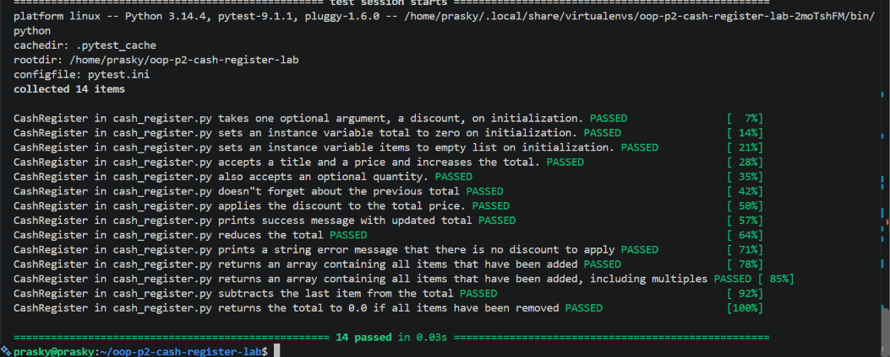

# Cash Register

A Python `CashRegister` class that models a simple cash register for an
e-commerce site. It supports adding items with quantities, applying a
percentage discount to the running total, and voiding the most recently
added transaction.

## Description

This project was built as part of an object-oriented design lab. The
`CashRegister` class demonstrates core OO concepts including:

- Encapsulated state (`total`, `items`, `previous_transactions`)
- A property with input validation (`discount` must be an integer
  between 0 and 100)
- Methods that mutate internal state based on business rules
  (`add_item`, `apply_discount`, `void_last_transaction`)

## Installation

This project uses `pipenv` for dependency management.

1. Clone the repo:
```bash
   git clone https://github.com/<your-username>/oop-p2-cash-register-lab.git
   cd oop-p2-cash-register-lab
```
2. Install dependencies:
```bash
   pipenv install
```

## Usage

```python
from cash_register import CashRegister

register = CashRegister(discount=20)

register.add_item("book", 15.00, 2)
register.add_item("pen", 2.50)

print(register.total)        # 32.5
print(register.items)        # ['book', 'book', 'pen']

register.apply_discount()
print(register.total)        # 26.0

register.void_last_transaction()
print(register.total)        # 20.0
print(register.items)        # ['book', 'book']
```

### Methods

| Method | Description |
|---|---|
| `add_item(item, price, quantity=1)` | Adds `quantity` units of `item` at `price` each to the register. |
| `apply_discount()` | Applies the register's discount percentage to the current total. |
| `void_last_transaction()` | Removes the most recently added transaction and adjusts total/items accordingly. |

## Testing

Run the test suite with:

```bash
pipenv run pytest lib/testing/cash_register_test.py -v
```

All 14 tests should pass:



## Support

If you run into issues, open an issue on this repository.

## Contributing

This is a solo lab project, but suggestions are welcome via pull request.

## Authors and acknowledgment

Built by [Your Name] as part of a software engineering curriculum lab
on object-oriented design.

## License

This project is for educational purposes.